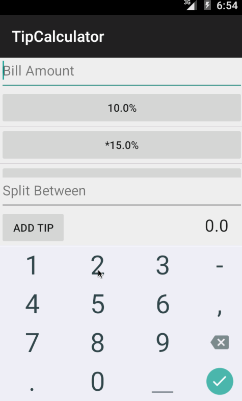

# Tip Calculator

This is an Android application that allows users to calculate tip based on the bill amount and optionally split it between 'n' people.

Time spent: 6 hours spent in total.

Completed user stories:

 * [x] User is displayed the tip of specified percentage for specified entered amount
 * [x] User enters the total amount of the transaction
 * [x] User can select between tip amounts (i.e 10%, 15%, 20%)
 * [x] Upon selecting tip amount, formatted tip value is displayed
 * [x] User changes the total amount and updated tip is reflected automatically
 * [x] User can select custom tip percentage if desired
 * [x] User can select how many ways to split the tip
 * [x] User can edit preset tip percentages and have them persist across launches
 * [ ] Experiment with trying input widgets to replace the buttons and/or textviews
 * [ ] Improve the user interface and experience by using images and/or colors
 
Walkthrough of all user stories:

